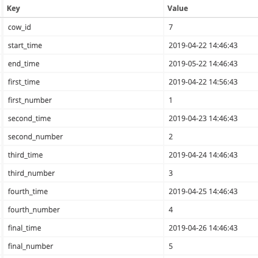
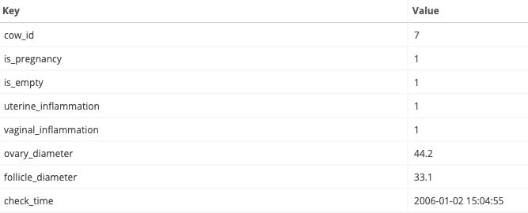

# 接口文档

>注：/api/v1，/admin的路由会有登录检验，在头部带上token，debug的时候可以在router中把apiv1.Use(jwt.JWT())注释掉就可以不用中间件。
有的表的设计并不好，所以有些字段会调整，之后（谁知道什么时候）会新加表，可能会有数据变动。

## 用户相关接口
* 获取token(后期修改)  GET  
/user?username=xxx&password=xxx
    * Response:  
        code:  
        msg:  
        data: token:xxx  

* 用户注册  POST   
/user
    * Request:
        username:xxx
        password:xxx
        e_mail:xxx
        telephone_number:xxx
    * Response:
        code:
        msg:
        data:

* 修改个人信息 PUT  
/api/v1/user
    * Request:
        username:xxx  
        password:xxx  
        e_mail:xxx  
        telephone_number:xxx  
    * Response:  
        code:  
        msg:  

* 用户获取自身信息 GET  
/api/v1/user
    * Response
        {  
    "code": 200,  
    "data": {  
        "id": 2,  
        "username": "whiskey",  
        "password": "123456",  
        "role": 1,   
        "telephone_number": "",  
        "e_mail": ""  
    },  
    "msg": "ok"  
}

## 产犊记录相关接口
* 获取第n页的产犊列表  GET  
当没有page时会返回全部数据
/api/v1/calves?page=n
    * Response:  
        {  
    "code": 200,  
    "data": {  
        "list": [  
            {  
                "id": 3,  
                "cow_id": 7,  
                "fetus_organ": "腿",  
                "is_complete": 1,  
                "is_abortion": 2,  
                "yak_id": 11,  
                "yak_index": 1,  
                "milk_production": 2,  
                "cream": 3,  
                "protein": 4,  
                "birth_time": "2019-04-21 14:46:43",  
                "flowing_time": "2019-04-23 14:46:43",  
                "fetus_time": "2019-04-23 14:46:43",  
                "fetus_birth_time": "2019-04-23 14:46:43",  
                "placenta_time": "2019-04-23 14:46:43"  
            },  
            {  
                "id": 4,  
                "cow_id": 101,  
                "fetus_organ": "head",  
                "is_complete": 1,  
                "is_abortion": 2,  
                "yak_id": 11,  
                "yak_index": 1,  
                "milk_production": 2,  
                "cream": 3,  
                "protein": 4,  
                "birth_time": "2019-04-21 14:46:43",  
                "flowing_time": "2019-04-23 14:46:43",  
                "fetus_time": "2019-04-23 14:46:43",  
                "fetus_birth_time": "2019-04-23 14:46:43",  
                "placenta_time": "2019-04-23 14:46:43"  
            }  
        ],  
        "total": 2  
    },  
    "msg": "ok"  
}  
* 通过cow_i获取产犊记录     GET  
/api/v1/calves/:cow_id  
    * Response:  
        {  
    "code": 200,  
    "data": [  
        {
            "id": 4,  
            "cow_id": 101,  
            "fetus_organ": "head",  
            "is_complete": 1,  
            "is_abortion": 2,  
            "yak_id": 11,  
            "yak_index": 1,  
            "milk_production": 2,  
            "cream": 3,  
            "protein": 4,  
            "birth_time": "2019-04-21 14:46:43",  
            "flowing_time": "2019-04-23 14:46:43",  
            "fetus_time": "2019-04-23 14:46:43",  
            "fetus_birth_time": "2019-04-23 14:46:43",  
            "placenta_time": "2019-04-23 14:46:43"  
        }  
    ],  
    "msg": "ok"  
}

* 增加产犊记录 POST  
/api/v1/calves
    * Request
        产犊记录里除了id的所有内容，字段名去看下model的后面的json标示中的字段。
    * Response
        code:
        msg:

## 配种记录相关接口
/api/v1/breeds
    * POST  PUT  
    Req:   
    
    * GET :cow_id  根据cowid查  
        Resp:  
        {  
            "code": 200,  
            "data": [  
                {  
                    "id": 3,  
                    "cow_id": 7,  
                    "last_birth_time": "2019-04-21 14:46:43",  
                    "start_time": "2019-04-22 14:46:43",  
                    "end_time": "2019-05-22 14:46:43",  
                    "first_time": "2019-04-22 14:56:43",  
                    "first_number": 1,  
                    "second_time": "2019-04-23 14:46:43",  
                    "second_number": 2,  
                    "third_time": "2019-04-24 14:46:43",  
                    "third_number": 3,  
                    "fourth_time": "2019-04-25 14:46:43",  
                    "fourth_number": 4,  
                    "final_time": "2019-04-26 14:46:43",  
                    "final_number": 5  
                }  
            ],  
            "msg": "ok"  
        }  
    * GET  获取所有  
    Resp:    
    {  
        "code": 200,  
        "data": {  
            "list": [  
                {  
                    "id": 3,  
                    "cow_id": 7,  
                    "last_birth_time": "2019-04-21 14:46:43",  
                    "start_time": "2019-04-22 14:46:43",  
                    "end_time": "2019-05-22 14:46:43",  
                    "first_time": "2019-04-22 14:56:43",  
                    "first_number": 1,  
                    "second_time": "2019-04-23 14:46:43",  
                    "second_number": 2,  
                    "third_time": "2019-04-24 14:46:43",  
                    "third_number": 3,  
                    "fourth_time": "2019-04-25 14:46:43",  
                    "fourth_number": 4,  
                    "final_time": "2019-04-26 14:46:43",  
                    "final_number": 5  
                }  
            ],  
            "total": 1  
        },   
        "msg": "ok"   
    }
  
 ## 妊娠诊断记录相关接口
 
 apiv1.GET("/pregnancy", v1.GetPregnancys)  
 apiv1.GET("/pregnancy/:cow_id", v1.GetPregnancy)  
 apiv1.POST("/pregnancy", v1.AddPregnancy)  
 apiv1.PUT("/pregnancy/:id", v1.UpdatePregnancy)  
 apiv1.DELETE("/pregnancy/:id", v1.DeletePregnancy)  
 
 * Request
    
 
 * Response  
 {  
     "code": 200,  
     "data": {  
         "list": [  
             {  
                 "Id": 1,  
                 "cow_id": 7,  
                 "check_time": "2006-01-02 15:04:55",  
                 "final_time": "2019-04-26 14:46:43",  
                 "estimate_time": "2020-02-25 14:46:43",  
                 "ovary_diameter": 44.2,  
                 "follicle_diameter": 33.1,  
                 "uterine_inflammation": 1,  
                 "vaginal_inflammation": 1,  
                 "is_pregnancy": 1,   
                 "is_empty": 1  
             },  
             {  
                 "Id": 2,  
                 "cow_id": 7,  
                 "check_time": "2006-01-02 15:04:55",  
                 "final_time": "2019-04-26 14:46:43",  
                 "estimate_time": "2020-02-25 14:46:43",  
                 "ovary_diameter": 44.2,  
                 "follicle_diameter": 33.1,  
                 "uterine_inflammation": 1,  
                 "vaginal_inflammation": 1,  
                 "is_pregnancy": 1,  
                 "is_empty": 1  
             }  
         ],  
         "total": 2  
     },  
     "msg": "ok"  
 }  